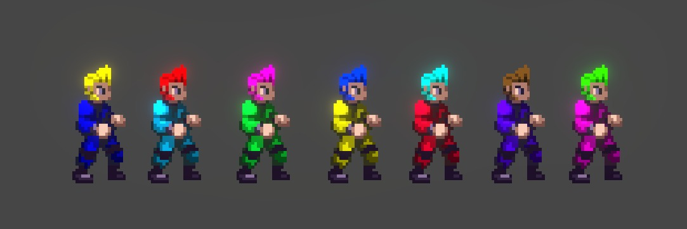

# SPEED

Developed for the Game Creator's Club at Lusofona University.
This month, the theme is "Speed". 

## Game

In this game, players will have to be doing maintenance on a starship during a race, ensuring that the ship arrives to the finishing line, as fast as possible.

## Todo

First scenario sprites and lighting

Oxygen, two players, extinguisher

Environment work, a lot of the systems in place

Blackout event

The alien attacks!

- Todo
  - Adjust events with part of the race (solar flares = more fires, asteroids = more hull breaches)
- Game modes
  - Tournament Mode - Get to the destination, as fast as possible, set names to players
  - Campaign Mode - Story/Tutorial mode for the game

## Art

- [Warped Space Marine](https://ansimuz.itch.io/warped-space-marine) by [Ansimuz](https://ansimuz.itch.io/), purchased
- [Fire Animation - Pixel Art FX Sprites](https://brullov.itch.io/fire-animation) by [Brulov](https://brullov.itch.io/), free to use
- [Explosion Pack](https://lorix.itch.io/explosion-pack) by [Lorix](https://lorix.itch.io/), free to use with credits
- [Alien](https://www.spriters-resource.com/arcade/alienvspredator/sheet/21042/) from the game 'Alien vs Predator', ripped by [Baselz](https://www.spriters-resource.com/submitter/Baselz/), no rights awarded
- Font [Optimus](https://www.dafont.com/pt/optimus.font) by [Pixel Sagas](https://www.dafont.com/pt/pixel-sagas.d32), free for non-commercial use.
- O2 icon from [FreePik](https://www.freepik.com/), free for non-commercial use.
- Rocket icon from [FreePik](https://www.freepik.com/), free for non-commercial use.
- Checkered flag from [Smashicons](https://smashicons.com/), free for use with attribution.
- [UI Pack Sci-Fi](https://kenney.nl/assets/ui-pack-sci-fi) by [Kenney](https://kenney.nl), licensed through the [CC0] license.
- Planets created with [Pixel Planet Generator](https://deep-fold.itch.io/pixel-planet-generator) by [Deep-Fold](https://deep-fold.itch.io/)
- Everything else done by [Diogo de Andrade], licensed through the [CC0] license.

## Sound

- [Game Start Sound](https://freesound.org/people/plasterbrain/sounds/243020/) by [plasterbrain](https://freesound.org/people/plasterbrain/), [CC0] license.
- [metal mesh stairs steps sound effect](https://freesound.org/people/Garuda1982/sounds/555386/) by [Garuda1982](https://freesound.org/people/Garuda1982/), [CC-BY 4.0] license.
- [grab-item](https://freesound.org/people/1bob/sounds/651515/) by [1bob](https://freesound.org/people/1bob/), [CC0] license.
- [ghost gun cock](https://freesound.org/people/martian/sounds/182229/) by [martian](https://freesound.org/people/martian/), [CC0] license.
- [Metal Drop bar resonance](https://freesound.org/people/jorickhoofd/sounds/160086/) by [jorickhoofd](https://freesound.org/people/jorickhoofd/), [CC-BY 4.0] license.
- [Rifle dropped on floor](https://freesound.org/people/ser%C3%B8t%C5%8Dnin/sounds/675009/) by [serøtōnin](https://freesound.org/people/ser%C3%B8t%C5%8Dnin/), [CC0] license.
- [2022-01-14-crystal-bell-14.flac](https://freesound.org/people/arseniiv/sounds/614834/) by [arseniiv](https://freesound.org/people/arseniiv/), [CC0] license.
- [Metal wheel](https://freesound.org/people/manuelaurreaf/sounds/490133/) by [manuelaurreaf](https://freesound.org/people/manuelaurreaf/), [CC-BY 4.0] license.
- [Another magic wand](https://freesound.org/people/kneekoo/sounds/548497/) by [kneekoo](https://freesound.org/people/kneekoo/), [CC0] license.
- [Unstable Nuclear Reactor](https://freesound.org/people/antwerpsounddesign/sounds/545953/) by [antwerpsounddesign](https://freesound.org/people/antwerpsounddesign/), [CC0] license.
- [Explosion (Close/Near)](https://freesound.org/people/EvanBoyerman/sounds/387229/) by [EvanBoyerman](https://freesound.org/people/EvanBoyerman/), [CC-BY 3.0] license.
- [Hull breach](https://freesound.org/people/jobro/sounds/244112/) by [jobro](https://freesound.org/people/jobro/), [CC0] license.
- [Blowtorch](https://freesound.org/people/HugoBozz/sounds/492771/) by [HugoBozz](https://freesound.org/people/HugoBozz/), [CC-BY-NC 3.0] license.
- [Fire Extinguisher](https://freesound.org/people/tranzfusion/sounds/642961/) by [tranzfusion](https://freesound.org/people/tranzfusion/), [CC0] license.
- [Gun Charge Up](https://freesound.org/people/Bird_man/sounds/316743/) by [Bird_man](https://freesound.org/people/Bird_man/), [CC0] license.
- [WarpDriver](https://freesound.org/people/shimsewn/sounds/62124/) by [shimsewn](https://freesound.org/people/shimsewn/), [CC-BY 4.0] license.
- [Light Electric Flow](https://freesound.org/people/Wakerone/sounds/393821/) by [Wakerone](https://freesound.org/people/Wakerone/), [CC0] license.
- [Breaker-1](https://freesound.org/s/404049/) by Deathscyp, [CC0] license.
- [Vent Footstep](https://freesound.org/people/h2p34/sounds/650510/) by [h2p34](https://freesound.org/people/h2p34/), [CC0] license.
- [Alien Xenomorph Hissing and Growling (with and without FX)](https://freesound.org/people/MSEpitaph/sounds/545484/) by [MSEpitaph](https://freesound.org/people/MSEpitaph/), [CC0] license.
- [Laser Shots](https://freesound.org/people/qubodup/sounds/212002/) by [Iwan Gabovitch](https://freesound.org/people/qubodup/),  [CC-BY 4.0] license.
- [Deflector Shield](https://freesound.org/people/Metzik/sounds/459782/) by [Metzik](https://freesound.org/people/Metzik/), [CC0] license.
- [Squish impact](https://freesound.org/people/Bertsz/sounds/500912/) by [Bertsz](https://freesound.org/people/Bertsz/), [CC0] license.
- [Male_Death_02](https://freesound.org/people/Artmasterrich/sounds/345451/) by [Artmasterrich](https://freesound.org/people/Artmasterrich/), [CC0] license.
- [health_1](https://freesound.org/people/zandernoriega/sounds/162387/) by [zandernoriega](https://freesound.org/people/zandernoriega/), [CC-BY 3.0] license.
- [Pick-up Health](https://freesound.org/people/juancamiloorjuela/sounds/204318/) by [juancamiloorjuela](https://freesound.org/people/juancamiloorjuela/), [CC0] license.
- [male_hurt1](https://freesound.org/people/micahlg/sounds/413176/) by [micahlg](https://freesound.org/people/micahlg/), [CC0] license.
- [BottleRocket07-Misfire](https://freesound.org/people/kingsrow/sounds/349790/) by [kingsrow](https://freesound.org/people/kingsrow/), [CC0] license.
- [Gas furnace](https://freesound.org/people/ldezem/sounds/386164/) by [ldezem](https://freesound.org/people/ldezem/), [CC0] license.
- [SteamLoopBody](https://freesound.org/people/kingof_thelab/sounds/340255/) by [kingof_thelab](https://freesound.org/people/kingof_thelab/), [CC-BY 3.0] license.
- [Ratchet Wrench](https://freesound.org/people/Groovy_Studio/sounds/717429/) by [Groovy_Studio](https://freesound.org/people/Groovy_Studio/), [CC0] license.
- Music is AI generated with [Soundful](soundful.com).
- Everything else done by [Diogo de Andrade], licensed through the [CC0] license.

## Code

- Some code was adapted/refactored from [Okapi Kit], [MIT] license.
- Uses [Unity Common], [MIT] license.
- All remaining game source code by Diogo de Andrade is licensed under the [MIT] license.

## Metadata

- Autor: [Diogo de Andrade]

[Diogo de Andrade]:https://github.com/DiogoDeAndrade
[CC0]:https://creativecommons.org/publicdomain/zero/1.0/
[CC-BY 3.0]:https://creativecommons.org/licenses/by/3.0/
[CC-BY-NC 3.0]:https://creativecommons.org/licenses/by-nc/3.0/
[CC-BY-SA 4.0]:http://creativecommons.org/licenses/by-sa/4.0/
[CC-BY 4.0]:https://creativecommons.org/licenses/by/4.0/
[OkapiKit]:https://github.com/VideojogosLusofona/OkapiKit
[Unity Common]:https://github.com/DiogoDeAndrade/UnityCommon
[Soundful]:
[MIT]:LICENSE
